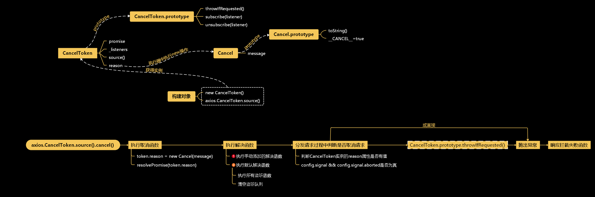

参考文档：[学习 axios 源码整体架构，打造属于自己的请求库](https://lxchuan12.gitee.io/axios/)
<a name="jeYCp"></a>
# 调试方法
<a name="GaTkB"></a>
## node环境
以Webstrom中node环境为例：

1. 打开`sandbox/client.js`文件
1. 删除不必要的内容
1. 用axios创建一个请求
1. 右键该文件
1. 点击“调试client.js”


<a name="hsATx"></a>
## 浏览器环境
找到文件`axios/examples/server.js`，修改代码如下：
```javascript
server = http.createServer(function (req, res) {
  var url = req.url;
  // 调试 examples
  console.log(url);
  // Process axios itself
  if (/axios\.min\.js$/.test(url)) {
    // 原来的代码 是 axios.min.js
    // pipeFileToResponse(res, '../dist/axios.min.js', 'text/javascript');
    pipeFileToResponse(res, '../dist/axios.js', 'text/javascript');
    return;
  }
  // 原来的代码 是 axios.min.map
  // if (/axios\.min.map$/.test(url)) {
  if (/axios\.map$/.test(url)) {
    // 原来的代码 是 axios.min.map
    // pipeFileToResponse(res, '../dist/axios.min.map', 'text/javascript');
    pipeFileToResponse(res, '../dist/axios.map', 'text/javascript');
    return;
  }
}
```
然后运行`examples/server.js`文件，在浏览器中打开[http://localhost:3000](http://localhost:3000)，就可以在浏览器中调试了
<a name="Rj7oJ"></a>
## 利用webstrom调试浏览器环境
webstrom的调试器比浏览器的调试器要好用（用过的都说好），webstrom中要想直接调试在浏览器环境下的axios会有些麻烦，但是调试如vue、react、angular这些主流框架项目却很简单，所以可以借助这些项目来达到目的。具体操作如下：

1. 项目中下载axios包
1. 打开`node_modules/axios/lib`文件夹
1. 在相关文件中添加断点
1. 运行项目
1. 控制条输出内容中ctrl+shift+鼠标左键点击[http://localhost:8080](http://localhost:300)（一定要点这个，点下面那个没用）
1. 在webstrom中调试


<a name="wWTjX"></a>
# 大致结构

<a name="vpBGO"></a>
# 看源码前的问题
看源码不能够只是为了看而看，这样容易迷失方向，我们应该带着问题去看源码，以这些问题为导向，更不容易看不下去。<br />这次看源码主要方向是：

1. 为什么axios既是对象又是函数 
1. 一个请求如何发送的
1. 请求拦截如何实现的
1. 取消功能如何实现的
1. axios兼容浏览器和node的原因
1. 为什么客户端支持防御XSRF（CSRF ）
<a name="RdOiX"></a>
# 入口文件、axios对象
axios真正的入口文件是`lib/axios.js`，这个文件创建并默认暴露出了`axios`对象。`axios`对象其实是一个包裹函数（函数也是对象），其中挂了一些列属性和方法，如：

- `Axios`实例的属性和方法
- `Axios.prototype`的属性和方法
- `create`方法
- `Axios`类
- 取消请求相关方法
- `all`方法
- `spread`方法
<a name="O65YY"></a>
## createInstance函数
`createInstance`函数先创建一个`axios`对象，然后创建一个包裹函数，将相关属性和方法挂到这个函数上，最后返回那个函数，这就是为什么`axios`既是对象又是函数：
```javascript
	/**
 * 创建Axios实例
 *
 * @param {Object} defaultConfig 实例的默认配置
 * @return {Axios} Axios的一个新实例
 */
function createInstance(defaultConfig) {
  var context = new Axios(defaultConfig)
  // 返回一个包裹函数，这个函数将Axios.prototype.request的this绑定为Axios的实例
  // 后续每次调用axios其实是调用Axios.prototype.request方法
  var instance = bind(Axios.prototype.request, context)

  // 复制axios.prototype到instance并指定this为刚创建的Axios实例
  // 所以axios具有Axios.prototype的方法和属性
  utils.extend(instance, Axios.prototype, context)

  // 将context复制到instance
  utils.extend(instance, context)

  // 用于创建新实例的工厂函数（工厂模式）
  instance.create = function create(instanceConfig) {
    return createInstance(mergeConfig(defaultConfig, instanceConfig))
  }

  return instance
}
```
`instance.create方`法运用了工厂模式，返回一个新的`axios`对象。
> **工厂方法模式**（英语：Factory method pattern）是一种实现了“工厂”概念的[面向对象](https://zh.wikipedia.org/wiki/%E9%9D%A2%E5%90%91%E5%AF%B9%E8%B1%A1) [设计模式](https://zh.wikipedia.org/wiki/%E8%AE%BE%E8%AE%A1%E6%A8%A1%E5%BC%8F_(%E8%AE%A1%E7%AE%97%E6%9C%BA)) 。就像其他[创建型模式](https://zh.wikipedia.org/wiki/%E5%89%B5%E5%BB%BA%E5%9E%8B%E6%A8%A1%E5%BC%8F) 一样，它也是处理在不指定[对象](https://zh.wikipedia.org/wiki/%E5%AF%B9%E8%B1%A1_(%E8%AE%A1%E7%AE%97%E6%9C%BA%E7%A7%91%E5%AD%A6)) 具体[类型](https://zh.wikipedia.org/wiki/%E7%B1%BB_(%E8%AE%A1%E7%AE%97%E6%9C%BA%E7%A7%91%E5%AD%A6)) 的情况下创建对象的问题。工厂方法模式的实质是“定义一个创建对象的接口，但让实现这个接口的类来决定实例化哪个类。工厂方法让类的实例化推迟到子类中进行。”

<a name="XBdpS"></a>
## mergeConfig方法
`mergeConfig`方法用于合并两个配置，在方法内部定义了各个属性合并的规则，如：

1. `url`、`method`、`data`属性合并方法是取第二个参数的值
1. `validateStatus`属性合并方法是`mergeDirectKeys`方法
1. 其他列举的都是`defaultToConfig2`方法

然后通过foreach合并配置：
```javascript

/**
 * 特定于配置的合并函数，该函数通过将两个配置对象合并在一起来创建新的配置对象。
 *
 * @param {Object} config1
 * @param {Object} config2
 * @returns {Object} 将config2合并到config1产生的新对象
 */
module.exports = function mergeConfig(config1, config2) {
  // eslint-disable-next-line no-param-reassign
  config2 = config2 || {}
  var config = {}

  /**
   * 获得合并后的值
   * @param target 目标对象
   * @param source 源对象
   * @return {{}|*} 合并后的致
   */
  function getMergedValue(target, source) {
    if (utils.isPlainObject(target) && utils.isPlainObject(source)) {
      return utils.merge(target, source)
    } else if (utils.isPlainObject(source)) {
      return utils.merge({}, source)
    } else if (utils.isArray(source)) {
      return source.slice()
    }
    return source
  }

  // eslint-disable-next-line consistent-return
  function mergeDeepProperties(prop) {
    //config2[prop]有值则以config2[prop]为准，否则以config1[prop]为准
    if (!utils.isUndefined(config2[prop])) {
      return getMergedValue(config1[prop], config2[prop])
    } else if (!utils.isUndefined(config1[prop])) {
      return getMergedValue(undefined, config1[prop])
    }
  }

  // eslint-disable-next-line consistent-return
  /**
   * 从config2中取值
   * @param prop 属性
   * @return {{}|*}
   */
  function valueFromConfig2(prop) {
    if (!utils.isUndefined(config2[prop])) {
      return getMergedValue(undefined, config2[prop])
    }
  }

  // eslint-disable-next-line consistent-return
  /**
   * 默认取config2的值，如果没有则取config1的值
   * @param prop 属性名
   * @return {{}|*} 属性值
   */
  function defaultToConfig2(prop) {
    if (!utils.isUndefined(config2[prop])) {
      return getMergedValue(undefined, config2[prop])
    } else if (!utils.isUndefined(config1[prop])) {
      return getMergedValue(undefined, config1[prop])
    }
  }

  // eslint-disable-next-line consistent-return
  /**
   * 合并直接键（包含在原型链上的属性），以config2为主导
   * @param prop 属性名
   * @return {{}|*} 合并的属性值
   */
  function mergeDirectKeys(prop) {
    if (prop in config2) {
      return getMergedValue(config1[prop], config2[prop])
    } else if (prop in config1) {
      return getMergedValue(undefined, config1[prop])
    }
  }

  //指定各个值合并的方法
  var mergeMap = {
    'url': valueFromConfig2,
    'method': valueFromConfig2,
    'data': valueFromConfig2,
    'baseURL': defaultToConfig2,
    'transformRequest': defaultToConfig2,
    'transformResponse': defaultToConfig2,
    'paramsSerializer': defaultToConfig2,
    'timeout': defaultToConfig2,
    'timeoutMessage': defaultToConfig2,
    'withCredentials': defaultToConfig2,
    'adapter': defaultToConfig2,
    'responseType': defaultToConfig2,
    'xsrfCookieName': defaultToConfig2,
    'xsrfHeaderName': defaultToConfig2,
    'onUploadProgress': defaultToConfig2,
    'onDownloadProgress': defaultToConfig2,
    'decompress': defaultToConfig2,
    'maxContentLength': defaultToConfig2,
    'maxBodyLength': defaultToConfig2,
    'transport': defaultToConfig2,
    'httpAgent': defaultToConfig2,
    'httpsAgent': defaultToConfig2,
    'cancelToken': defaultToConfig2,
    'socketPath': defaultToConfig2,
    'responseEncoding': defaultToConfig2,
    'validateStatus': mergeDirectKeys
  }

  //遍历config1和config2的键
  utils.forEach(Object.keys(config1).concat(Object.keys(config2)), function computeConfigValue(prop) {
    //合并方法，默认是mergeDeepProperties
    var merge = mergeMap[prop] || mergeDeepProperties
    var configValue = merge(prop);
    (utils.isUndefined(configValue) && merge !== mergeDirectKeys) || (config[prop] = configValue)
  })

  return config
}
```
<a name="MGUzg"></a>
## 完整代码
```javascript
'use strict'
//工具类
var utils = require('./utils')
//bind方法
var bind = require('./helpers/bind')
//Axios构造函数
var Axios = require('./core/Axios')
//配置合并函数
var mergeConfig = require('./core/mergeConfig')
//默认配置
var defaults = require('./defaults')

/**
 * 创建Axios实例
 *
 * @param {Object} defaultConfig 实例的默认配置
 * @return {Axios} Axios的一个新实例
 */
function createInstance(defaultConfig) {
  var context = new Axios(defaultConfig)
  // 返回一个包裹函数，这个函数将Axios.prototype.request的this绑定为Axios的实例
  // 后续每次调用axios其实是调用Axios.prototype.request方法
  var instance = bind(Axios.prototype.request, context)

  // 复制axios.prototype到instance并指定this为刚创建的Axios实例
  // 所以axios具有Axios.prototype的方法和属性
  utils.extend(instance, Axios.prototype, context)

  // 将context复制到instance
  utils.extend(instance, context)

  // 用于创建新实例的工厂函数（工厂模式）
  instance.create = function create(instanceConfig) {
    return createInstance(mergeConfig(defaultConfig, instanceConfig))
  }

  return instance
}

// 创建要导出的默认实例
var axios = createInstance(defaults)

// 公开Axios类以允许类继承
axios.Axios = Axios

// 暴露Cancel和CancelToken等
axios.Cancel = require('./cancel/Cancel')
axios.CancelToken = require('./cancel/CancelToken')
axios.isCancel = require('./cancel/isCancel')
axios.VERSION = require('./env/data').version

// 暴露all和spread方法
axios.all = function all(promises) {
  //axios.all其实就是Promise.all
  return Promise.all(promises)
}
axios.spread = require('./helpers/spread')

// 暴露isAxiosError
axios.isAxiosError = require('./helpers/isAxiosError')

module.exports = axios

// 允许在TypeScript中使用默认导入语法
// import axios from 'axios'
module.exports.default = axios
```


<a name="LaJNW"></a>
# Axios构造函数
文件`lib/core/Axios.js`定义了核心构造函数`Axios`构造函数，其中分成这几块：

1. 定义`Axios`构造函数
1. 定义`Axios.prototype.request`方法
1. Axios.prototype.getUri方法
1. 为支持的请求方法添加别名方法
<a name="SjBZE"></a>
## Axios构造函数
`Axios`函数很简单：
```javascript
/**
 * 创建Axios的新实例
 *
 * @param {Object} instanceConfig 实例的默认配置
 */
function Axios(instanceConfig) {
  //设置默认参数
  this.defaults = instanceConfig
  //配置请求、响应拦截
  this.interceptors = {
    request: new InterceptorManager(),
    response: new InterceptorManager()
  }
}
```
<a name="ke9RN"></a>
## 拦截器构造函数（InterceptorManager）
拦截器其实就是一个数组：
```javascript
function InterceptorManager() {
  this.handlers = []
}
```
当调用`use`方法时添加拦截器对象到数组中并返回添加的拦截器对象数组中下标作为拦截器对象ID：
```javascript
/**
 * 将新的拦截器添加到堆栈中
 *
 * @param {Function} fulfilled 用于处理`then`返回的`Promise`的函数
 * @param {Function} rejected 用于处理``reject`返回的`Promise`的函数
 *
 * @return {Number} 用于稍后删除拦截器的ID
 */
InterceptorManager.prototype.use = function use(fulfilled, rejected, options) {
  this.handlers.push({
    fulfilled: fulfilled,
    rejected: rejected,
    synchronous: options ? options.synchronous : false,
    runWhen: options ? options.runWhen : null
  })
  return this.handlers.length - 1
}
```
调用`eject`方法将对应下标的拦截器对象从数组中移除：
```javascript
/**
 * 从堆栈中删除拦截器
 *
 * @param {Number} id “使用” 返回的ID
 */
InterceptorManager.prototype.eject = function eject(id) {
  if (this.handlers[id]) {
    this.handlers[id] = null
  }
}
```
原型上的`forEach`方法则提供了拦截器遍历功能：
```javascript
/**
 * 迭代所有已注册的拦截器
 *
 * 此方法对于跳过可能调用'eject'已成为 'null' 的任何拦截器特别有用。
 *
 * @param {Function} fn 每个拦截器要调用的函数
 */
InterceptorManager.prototype.forEach = function forEach(fn) {
  //调用utils上的forEach函数，然后在调用传入的fn函数
  utils.forEach(this.handlers, function forEachHandler(h) {
    //跳过是null的拦截器
    if (h !== null) {
      fn(h)
    }
  })
}
```
<a name="IR4Yn"></a>
## request方法
`request`方法是axios的核心方法之一，这个方法执行发送请求的一些前置操作，比如：

1. 合并配置
   1. 传入第一个参数是字符串，则设置为请求地址；第二个参数是配置
   1. 第一个参数不是字符串则是配置，默认是一个空对象
   1. 将配置和默认配置合并（以传入的配置为主）
2. 设置请求方法，将设置的请求方式转换成小写，默认是`get`
2. 将请求拦截器、分发请求、响应拦截器串联成一个期约（Promise）链
2. 开始这个期约（Promise）链
   1. 同步请求通过直接调用请求拦截器开始
   1. 异步请求则是将`promise`变量设置成一个解决结果为合并后的配置开始
<a name="OSAT7"></a>
### 合并配置
```javascript
if (typeof config === 'string') {
  // 允许如axios('example/url' [，config])那样发送请求
  config = arguments[1] || {}
  config.url = arguments[0]
} else {
  //或者像axios({url:'example/url',...otherConfig})那样发送请求
  config = config || {}
}

config = mergeConfig(this.defaults, config)
```
<a name="ejukg"></a>
### 设置请求方法
请求方法会被转换成小写，如果没有配置则使用默认配置的请求方式，还是没有则设置成`get`
```javascript
// 设置config.method（转换成小写），默认get
// 因为会转换成小写，所以请求方式大小写并不敏感
if (config.method) {
  config.method = config.method.toLowerCase()
} else if (this.defaults.method) {
  config.method = this.defaults.method.toLowerCase()
} else {
  config.method = 'get'
}
```
<a name="hRMsj"></a>
### 期约（Promise）链
期约（Promise）链保证了先执行请求拦截器、再分发请求、最后执行响应拦截器的顺序。<br />​

什么是期约（Promise）链？<br />期约（Promise）是可以链式调用的（如果你还不太熟悉Promise，建议去看看阮一峰写的[ECMAScript6入门](https://es6.ruanyifeng.com/#docs/promise)），比如下面代码：
```javascript
const promise = new Promise(resolve => {
  console.log('promise')
  // 这个期约在1s之后解决，其结果是1
  setTimeout(resolve, 1000, 1)
}).then((num) => {
  console.log('promise1')
  // 返回解决结果是num*10的期约
  return num * 10
}).then((num) => {
  console.log('promise2')
  // 返回解决结果是num*20的期约
  return num * 20
}).then(console.log)
/*
* 执行结果：
* promise
* promise1
* promise2
* 200
* */
```
这种机制保证了链式调用的可能，而axios也是利用这一特性实现期约链。<br />
<br />生成请求拦截器链，并判断是否是同步请求：
```javascript
// 过滤掉跳过的请求拦截器
var requestInterceptorChain = []
var synchronousRequestInterceptors = true
this.interceptors.request.forEach(function unshiftRequestInterceptors(interceptor) {
  if (typeof interceptor.runWhen === 'function' && interceptor.runWhen(config) === false) {
    return
  }

  //只有全都是同步请求，才是true
  synchronousRequestInterceptors = synchronousRequestInterceptors && interceptor.synchronous

  //越先添加的拦截器越后执行
  requestInterceptorChain.unshift(interceptor.fulfilled, interceptor.rejected)
})
```
​

生成响应拦截器链：
```javascript
var responseInterceptorChain = []
this.interceptors.response.forEach(function pushResponseInterceptors(interceptor) {
  responseInterceptorChain.push(interceptor.fulfilled, interceptor.rejected)
})
```
​

如果是异步请求则直接将请求拦截器链、分发请求、响应拦截器连组合成一个期约（Promise）链并开始这个期约链：
```javascript
if (!synchronousRequestInterceptors) {
  //添加undefined是因为后面遍历时是两个两个一起的
  var chain = [dispatchRequest, undefined]

  //将请求拦截链添加到chain前面，达到的效果是先执行请求拦截再分发请求
  Array.prototype.unshift.apply(chain, requestInterceptorChain)
  //将响应拦截链连接到chain上，最终效果是分发请求响应后依次执行响应拦截
  chain = chain.concat(responseInterceptorChain)

  //生成解决结果为config的期约实例，开始期约链
  promise = Promise.resolve(config)
  while (chain.length) {
    //请求拦截器、分发请求、响应拦截串联成Promise的链式调用，当期约被解决/拒绝时调用
    promise = promise.then(chain.shift(), chain.shift())
  }

  return promise
}
```
​

同步请求则是先执行请求拦截器链，然后分发请求，最后依次执行响应拦截器链：
```javascript
var newConfig = config
//同步请求的话依次执行请求拦截器，并从拦截器链中移除
while (requestInterceptorChain.length) {
  var onFulfilled = requestInterceptorChain.shift()
  var onRejected = requestInterceptorChain.shift()
  try {
    newConfig = onFulfilled(newConfig)
  } catch (error) {
    onRejected(error)
    break
  }
}

//而后分发请求
try {
  promise = dispatchRequest(newConfig)
} catch (error) {
  return Promise.reject(error)
}

//最后依次执行响应拦截器并从拦截器链中移除
while (responseInterceptorChain.length) {
  //请求拦截器、分发请求、响应拦截串联成Promise的链式调用
  promise = promise.then(responseInterceptorChain.shift(), responseInterceptorChain.shift())
}

return promise
```
最终流程图如下：<br />
<a name="HBoDv"></a>
## getUri方法
`getUri`方法很简单，就是合并配置，然后返回构建的uri：
```javascript
Axios.prototype.getUri = function getUri(config) {
  //合并配置
  config = mergeConfig(this.defaults, config)
  return buildURL(config.url, config.params, config.paramsSerializer).replace(/^\?/, '')
}
```
<a name="MB2GB"></a>
## buildURL方法
`buildURL`方法将`params`转换成查询字符串拼接到`url`后面：
```javascript
function buildURL(url, params, paramsSerializer) {
  /*eslint no-param-reassign:0*/
  if (!params) {
    return url
  }

  var serializedParams
  if (paramsSerializer) {
    //传递有序列化函数，直接调用该函数序列化
    serializedParams = paramsSerializer(params)
  } else if (utils.isURLSearchParams(params)) {
    //是URLSearchParams对象直接转换成字符串
    //URLSearchParams：https://developer.mozilla.org/zh-CN/docs/Web/API/URLSearchParams
    serializedParams = params.toString()
  } else {
    var parts = []

    utils.forEach(params, function serialize(val, key) {
      //无效值直接退出这次遍历
      if (val === null || typeof val === 'undefined') {
        return
      }

      if (utils.isArray(val)) {
        //处理数组的key
        key = key + '[]'
      } else {
        // 不是数组则转换成数组
        val = [val]
      }

      //遍历值数组，并将其转换成字符串
      utils.forEach(val, function parseValue(v) {
        if (utils.isDate(v)) {
          //日期转换成ISO字符串形式
          v = v.toISOString()
        } else if (utils.isObject(v)) {
          //对象转换成JSON形式
          v = JSON.stringify(v)
        }
        //键值对用“=”拼接，然后追加到数组上
        parts.push(encode(key) + '=' + encode(v))
      })
    })

    //最后将数组项用&拼接
    serializedParams = parts.join('&')
  }

  if (serializedParams) {
    //处理具有哈希值的url
    var hashmarkIndex = url.indexOf('#')
    if (hashmarkIndex !== -1) {
      //只截取“#”前面部分
      url = url.slice(0, hashmarkIndex)
    }

    //判断有没有“?”
    url += (url.indexOf('?') === -1 ? '?' : '&') + serializedParams
  }

  return url
}
```
<a name="M72Al"></a>
## 别名请求方法
通过foreach方法遍历请求方式，每次遍历设置对应请求方式的方法在原型上：
```javascript
// 为支持的请求方法提供别名，使我们可以使用axios.get()的方式请求接口
utils.forEach(['delete', 'get', 'head', 'options'], function forEachMethodNoData(method) {
  /*eslint func-names:0*/
  Axios.prototype[method] = function (url, config) {
    return this.request(mergeConfig(config || {}, {
      method: method,
      url: url,
      data: (config || {}).data
    }))
  }
})

utils.forEach(['post', 'put', 'patch'], function forEachMethodWithData(method) {
  /*eslint func-names:0*/
  Axios.prototype[method] = function (url, data, config) {
    return this.request(mergeConfig(config || {}, {
      method: method,
      url: url,
      data: data
    }))
  }
})
```
<a name="h69bB"></a>
# dispatchRequest函数（发分发请求）
`lib/core/dispatchRequest.js`的`dispatchRequest`函数也是axios核心函数之一，这个函数的功能是请求发送的前置和后置操作，如：

1. 判断是否取消
1. 转换请求数据
1. 合并请求头
1. 转换相应数据
```javascript
'use strict'

var utils = require('./../utils')
var transformData = require('./transformData')
var isCancel = require('../cancel/isCancel')
var defaults = require('../defaults')
var Cancel = require('../cancel/Cancel')

/**
 * 如果要取消请求，则抛出 “Cancel”。
 */
function throwIfCancellationRequested(config) {
  // 如果配置有cancelToke，则调用cancelToken.throwIfRequested()
  if (config.cancelToken) {
    config.cancelToken.throwIfRequested()
  }

  if (config.signal && config.signal.aborted) {
    throw new Cancel('canceled')
  }
}

/**
 * 使用配置的适配器将请求分派到服务器。
 *
 * @param {object} config 用于请求的配置
 * @returns {Promise} 要兑现的期约
 */
module.exports = function dispatchRequest(config) {
  throwIfCancellationRequested(config)

  // 确保headers存在
  config.headers = config.headers || {}

  // 转换请求数据
  config.data = transformData.call(
    config,
    config.data,
    config.headers,
    config.transformRequest
  )

  // 铺平headers
  config.headers = utils.merge(
    config.headers.common || {},
    config.headers[config.method] || {},
    config.headers
  )

  //上面将headers合并为一个headers对象，所以不需要所有请求方式的headers配置了
  utils.forEach(
    ['delete', 'get', 'head', 'post', 'put', 'patch', 'common'],
    function cleanHeaderConfig(method) {
      delete config.headers[method]
    }
  )

  //适配器
  var adapter = config.adapter || defaults.adapter

  return adapter(config).then(function onAdapterResolution(response) {
    throwIfCancellationRequested(config)

    // 转换响应数据
    response.data = transformData.call(
      config,
      response.data,
      response.headers,
      config.transformResponse
    )

    return response
  }, function onAdapterRejection(reason) {
    if (!isCancel(reason)) {
      throwIfCancellationRequested(config)

      // 转换响应数据
      if (reason && reason.response) {
        reason.response.data = transformData.call(
          config,
          reason.response.data,
          reason.response.headers,
          config.transformResponse
        )
      }
    }

    return Promise.reject(reason)
  })
}
```
<a name="FrIul"></a>
# getDefaultAdapter函数（适配器）
axios的一大特性便是兼容NodeJS环境和浏览器环境，而支持这一特性的功能便是适配器，`/lib/defaults.js`中的`getDefaultAdapter`函数会根据当前环境选择合适的适配器发送网络请求：
```javascript
function getDefaultAdapter() {
  var adapter
  if (typeof XMLHttpRequest !== 'undefined') {
    // 对于浏览器使用XHR适配器
    adapter = require('./adapters/xhr')
  } else if (typeof process !== 'undefined' && Object.prototype.toString.call(process) === '[object process]') {
    // 对于节点使用HTTP适配器
    adapter = require('./adapters/http')
  }
  return adapter
}

var defaults = {
  adapter: getDefaultAdapter(),
  // ...
}
```
其中`http.js`对应了NodeJS环境下的网络请求，`xh.js`对应了浏览器环境下的网络请求
<a name="dKZzq"></a>
# xhrAdapter函数（浏览器环境适配器）
`/lib/adapters/xhr.js`的`xhrAdapter`函数是浏览器环境对应的网络适配器，这个方法是最终发送请求的方法，这个方法进行[XHR](https://developer.mozilla.org/zh-CN/docs/Web/API/XMLHttpRequest)对象执行网络请求的一系列操作，如：

1. 处理请求头
1. 设置身份验证
1. 构建实际请求路径
1. 设置超时
1. 设置各种事件监听，如：abort、loadend、error、timeout、progress
1. 设置相应数据类型

​

axios对各种事件做了兼容，如`loadend`事件，如果不支持则会用`onreadystatechange`模拟这个事件：
```javascript
if ('onloadend' in request) {
  // 如果可用，则使用onloadend
  request.onloadend = onloadend
} else {
  // loadend事件不可用，则监听就绪状态以模拟onloadend
  request.onreadystatechange = function handleLoad () {
    if (!request || request.readyState !== 4) {
      return
    }

    // 请求出错了，我们没有得到回应，
    // 这将由onerror来处理，但有一个例外: 请求使用file: protocol，大多数浏览器将返回状态为0，即使这是一个成功的请求
    if (request.status === 0 && !(request.responseURL && request.responseURL.indexOf('file:') === 0)) {
      return
    }
    // readystate处理程序在onerror或ontimeout处理程序之前调用，因此我们应该在下一个 'tick' 上调用onloadend
    setTimeout(onloadend)
  }
}
```

<br />axios也支持XSRF防御：
```javascript
// 添加xsrf标题（XSRF防御）
// 只有在标准浏览器环境中运行时，才会这样做。
// 特别是如果我们在一个网络工作者，或者反应原生。
if (utils.isStandardBrowserEnv()) {
  // 添加xsrf标题
  var xsrfValue = (config.withCredentials || isURLSameOrigin(fullPath)) && config.xsrfCookieName ?
      cookies.read(config.xsrfCookieName) :
  		undefined

  if (xsrfValue) {
    requestHeaders[config.xsrfHeaderName] = xsrfValue
  }
}
```
完整代码：
```javascript
function xhrAdapter (config) {
  return new Promise(function dispatchXhrRequest (resolve, reject) {
    var requestData = config.data
    var requestHeaders = config.headers
    var responseType = config.responseType
    var onCanceled

    //完成时调用的函数，用于取消相关事件监听
    function done () {
      if (config.cancelToken) {
        config.cancelToken.unsubscribe(onCanceled)
      }

      if (config.signal) {
        config.signal.removeEventListener('abort', onCanceled)
      }
    }

    //如果请求数据是FormData，则删除Content-Type，让浏览器设置Content-Type
    if (utils.isFormData(requestData)) {
      delete requestHeaders['Content-Type'] // 让浏览器设置
    }

    var request = new XMLHttpRequest()

    // HTTP基本身份验证
    if (config.auth) {
      var username = config.auth.username || ''
      var password = config.auth.password ? unescape(encodeURIComponent(config.auth.password)) : ''
      requestHeaders.Authorization = 'Basic ' + btoa(username + ':' + password)
    }

    //真实路径是设置的baseURL+请求的url
    var fullPath = buildFullPath(config.baseURL, config.url)
    request.open(config.method.toUpperCase(), buildURL(fullPath, config.params, config.paramsSerializer), true)

    // 在MS中设置请求超时
    request.timeout = config.timeout

    function onloadend () {
      if (!request) {
        return
      }
      // 准备响应
      var responseHeaders = 'getAllResponseHeaders' in request ? parseHeaders(request.getAllResponseHeaders()) : null
      //取得响应数据
      var responseData = !responseType || responseType === 'text' || responseType === 'json' ?
        request.responseText : request.response
      var response = {
        data: responseData,
        status: request.status,
        statusText: request.statusText,
        headers: responseHeaders,
        config: config,
        request: request
      }

      //根据状态做出相应的动作（解决/拒绝期约）并清除事件监听和消息订阅
      settle(function _resolve (value) {
        resolve(value)
        done()
      }, function _reject (err) {
        reject(err)
        done()
      }, response)

      // 清理请求
      request = null
    }

    if ('onloadend' in request) {
      // 如果可用，则使用onloadend
      request.onloadend = onloadend
    } else {
      // loadend事件不可用，则监听就绪状态以模拟onloadend
      request.onreadystatechange = function handleLoad () {
        if (!request || request.readyState !== 4) {
          return
        }

        // 请求出错了，我们没有得到回应，
        // 这将由onerror来处理，但有一个例外: 请求使用file: protocol，大多数浏览器将返回状态为0，即使这是一个成功的请求
        if (request.status === 0 && !(request.responseURL && request.responseURL.indexOf('file:') === 0)) {
          return
        }
        // readystate处理程序在onerror或ontimeout处理程序之前调用，因此我们应该在下一个 'tick' 上调用onloadend
        setTimeout(onloadend)
      }
    }

    // 处理浏览器请求取消 (与手动取消相对)
    request.onabort = function handleAbort () {
      if (!request) {
        return
      }

      reject(createError('Request aborted', config, 'ECONNABORTED', request))

      // 清理请求
      request = null
    }

    // 处理低级网络错误
    request.onerror = function handleError () {
      // 浏览器对我们隐藏了真正的错误，onerror应该只在网络错误时触发
      reject(createError('Network Error', config, null, request))

      // 清理请求
      request = null
    }

    // 处理超时
    request.ontimeout = function handleTimeout () {
      var timeoutErrorMessage = config.timeout ? 'timeout of ' + config.timeout + 'ms exceeded' : 'timeout exceeded'
      var transitional = config.transitional || defaults.transitional
      //如果有配置超时信息则使用配置的
      if (config.timeoutErrorMessage) {
        timeoutErrorMessage = config.timeoutErrorMessage
      }
      reject(createError(
        timeoutErrorMessage,
        config,
        transitional.clarifyTimeoutError ? 'ETIMEDOUT' : 'ECONNABORTED',
        request))

      // 清理请求
      request = null
    }

    // 添加xsrf标题（XSRF防御）
    // 只有在标准浏览器环境中运行时，才会这样做。
    // 特别是如果我们在一个网络工作者，或者反应原生。
    if (utils.isStandardBrowserEnv()) {
      // 添加xsrf标题
      var xsrfValue = (config.withCredentials || isURLSameOrigin(fullPath)) && config.xsrfCookieName ?
        cookies.read(config.xsrfCookieName) :
        undefined

      if (xsrfValue) {
        requestHeaders[config.xsrfHeaderName] = xsrfValue
      }
    }

    // 将headers添加到请求中
    if ('setRequestHeader' in request) {
      utils.forEach(requestHeaders, function setRequestHeader (val, key) {
        if (typeof requestData === 'undefined' && key.toLowerCase() === 'content-type') {
          // 如果没有data选项，则删除content-type
          delete requestHeaders[key]
        } else {
          // 否则将标头添加到请求中
          request.setRequestHeader(key, val)
        }
      })
    }

    // 如果需要，添加凭据给请求
    if (!utils.isUndefined(config.withCredentials)) {
      request.withCredentials = !!config.withCredentials
    }

    // 有配置响应类型并且不是json，则添加到请求中
    if (responseType && responseType !== 'json') {
      request.responseType = config.responseType
    }

    // 设置了onDownloadProgress函数则添加progress事件
    if (typeof config.onDownloadProgress === 'function') {
      request.addEventListener('progress', config.onDownloadProgress)
    }

    // 并非所有浏览器都支持上传事件
    if (typeof config.onUploadProgress === 'function' && request.upload) {
      request.upload.addEventListener('progress', config.onUploadProgress)
    }

    //如果配置上有cancelToken或者signal属性就代表着要取消
    if (config.cancelToken || config.signal) {
      // 处理取消
      // eslint-disable-next-line func-names
      onCanceled = function (cancel) {
        if (!request) {
          return
        }
        reject(!cancel || (cancel && cancel.type) ? new Cancel('canceled') : cancel)
        request.abort()
        request = null
      }

      config.cancelToken && config.cancelToken.subscribe(onCanceled)
      if (config.signal) {
        config.signal.aborted ? onCanceled() : config.signal.addEventListener('abort', onCanceled)
      }
    }

    if (!requestData) {
      requestData = null
    }

    // 发送请求
    request.send(requestData)
  })
}
```
<a name="nQE5E"></a>
# 取消请求的实现
取消请求的核心功能实现是文件`/lib/cancel/CancelToken.js`
<a name="u2gUv"></a>
## CancelToken构造函数
取消功能借由期约实现异步执行，在函数内部先添加默认解决函数，而后重写了`promise`属性的`then`方法以用于后面添加解决函数，待自定义`then`方法执行完所有解决函数后才会执行默认的`then`方法添加的解决函数：
```javascript
// eslint-disable-next-line func-names
//添加默认解决函数
this.promise.then(function (cancel) {
  if (!token._listeners) return

  var i
  var l = token._listeners.length

  for (i = 0; i < l; i++) {
    //依次执行监听器
    token._listeners[i](cancel)
  }
  //清空监听器
  token._listeners = null
})

// eslint-disable-next-line func-names
//重写then方法，用于自行添加期约解决后的回调，代码执行时会先调用重写的then，然后调用原生的then
/*
    可使用如下面方式添加解决函数：
    const source = axios.CancelToken.source()
    source.token.promise.then(() => {
      console.log('自定义的解决函数')
    })
   */
this.promise.then = function (onfulfilled) {
  var _resolve
  // eslint-disable-next-line func-names
  var promise = new Promise(function (resolve) {
    token.subscribe(resolve)
    _resolve = resolve
  }).then(onfulfilled)

  promise.cancel = function reject() {
    token.unsubscribe(_resolve)
  }

  return promise
}
```
最后调用传入的执行器，传入取消函数：
```javascript
//执行器传入的匿名参数会在CancelToken.source().cancel()调用时调用
executor(function cancel(message) {
  if (token.reason) {
    // 已经要求取消
    return
  }

  token.reason = new Cancel(message)
  resolvePromise(token.reason)
})
```
最后在source方法中赋值给返回值：
```javascript
/**
 * 返回一个对象，该对象包含一个新的 'CancelToken' 和一个函数，该函数在调用时会取消 'CancelToken'。
 */
CancelToken.source = function source() {
  var cancel
  var token = new CancelToken(function executor(c) {
    cancel = c
  })
  return {
    token: token,
    cancel: cancel
  }
}
```
<a name="y89sS"></a>
## subscribe函数
利用数组实现监听队列：
```javascript
/**
 * 订阅取消信号
 */
CancelToken.prototype.subscribe = function subscribe(listener) {
  //如果已经取消，则直接执行
  if (this.reason) {
    listener(this.reason)
    return
  }

  //添加监听器到队列中
  if (this._listeners) {
    this._listeners.push(listener)
  } else {
    this._listeners = [listener]
  }
}
```
<a name="upz6p"></a>
## unsubscribe函数
```javascript
/**
 * 取消订阅取消信号
 */
CancelToken.prototype.unsubscribe = function unsubscribe(listener) {
  if (!this._listeners) {
    return
  }
  var index = this._listeners.indexOf(listener)
  if (index !== -1) {
    this._listeners.splice(index, 1)
  }
}
```
<a name="oO6sn"></a>
## 取消判断依据
在axios建立并发送请求的过程中判断是否取消请求的依据是：
1. 判断`CancelToken`实例的`reason`属性是否有值
2. `config.signal && config.signal.aborted`是否为真
## 流程图

<a name="wx1t4"></a>
# 拦截器结构和流程
拦截器由请求拦截和响应拦截组成，在Axios实例中是一个请求拦截器对象：
```javascript
function Axios(instanceConfig) {
  //配置请求、响应拦截
  this.interceptors = {
    request: new InterceptorManager(),
    response: new InterceptorManager()
  }
}
```
添加拦截器方式如下：
```javascript
// 添加请求拦截器
axios.interceptors.request.use(function (config) {
    // 在发送请求之前做些什么
    return config;
  }, function (error) {
    // 对请求错误做些什么
    return Promise.reject(error);
  });

// 添加响应拦截器
axios.interceptors.response.use(function (response) {
    // 2xx 范围内的状态码都会触发该函数。
    // 对响应数据做点什么
    return response;
  }, function (error) {
    // 超出 2xx 范围的状态码都会触发该函数。
    // 对响应错误做点什么
    return Promise.reject(error);
  });
```
调用`InterceptorManager.prototype.use()`方法会在拦截器实例上添加一个对象，这个对象包含期约的解决和拒接函数（具体实现请看拦截器构造函数那块内容）。最后在`Axios.prototype.request`方法中将请求拦截、分发请求和响应拦截组成期约链（具体实现看期约链那块内容），最后由`promise = Promise.resolve(config)`开始这个期约链。具体流程图如下：<br />
<a name="Icb5Q"></a>
# 发送请求的流程

<a name="YPzeS"></a>
# 完整流程图

<a name="OZ4v9"></a>
# Axios小技巧

1. axios默认请求方式是`get`，所以如果是get请求，则可以不配置
1. axios对于请求方式会统一转化为小写，所以请求方式写法可以狂放不羁，如：`get`、`Get`、`GEt`、`GET`、`GeT`（为了好看，还是统一小写比较好）
1. 请求的数据是`FormData`或者发送的请求没有data选项时，`Content-Type`会被删除，因为`Content-Type`在这两种情况下是没有意义的


